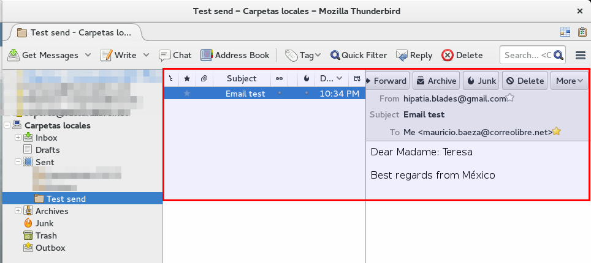

Envoi de courriel
=================

Envoyer un courriel et attendre le résultat
-------------------------------------------

.. code-block:: vbnet

    Sub SendMail()
        util = createUnoService("org.universolibre.EasyDev")

        server = createUnoStruct("org.universolibre.EasyDev.SmtpServer")
        message = createUnoStruct("org.universolibre.EasyDev.EmailMessage")

        server.Name = "smtp.gmail.com"
        server.User = "hipatia.blades@gmail.com"
        server.Password = "supersecret"
        server.Ssl = True

        temp = "Dear Madame: $name\n\nBest regards from $country"
        data = Array( _
            Array("name", "Teresa"), _
            Array("country", "México"), _
        )
        body = util.render(temp, data)

        message.To = "public@mauriciobaeza.net"
        message.Subject = "Email test"
        message.Body = body

        'Send mail and wait response
        result = util.sendMail(server, message)
        If result Then
            MsgBox "Send mail"
        Else
            MsgBox "Error send mail"
        End If
    End Sub

Envoi de courriel sans attente
------------------------------

.. code-block:: vbnet

    Sub SendMailNoWait()
        util = createUnoService("org.universolibre.EasyDev")

        server = createUnoStruct("org.universolibre.EasyDev.SmtpServer")
        message = createUnoStruct("org.universolibre.EasyDev.EmailMessage")

        server.Name = "smtp.gmail.com"
        server.User = "hipatia.blades@gmail.com"
        server.Password = "supersecret"
        server.Ssl = True
        server.Thread = True    'Send in other thread

        temp = "Dear Madame: $name\n\nBest regards from $country"
        data = Array( _
            Array("name", "Teresa"), _
            Array("country", "México"), _
        )
        body = util.render(temp, data)

        message.To = "public@mauriciobaeza.net"
        message.Subject = "Email test"
        message.Body = body

        'Send mail and NO wait response
        util.sendMail(server, message)
        MsgBox "Send mail"

    End Sub

Envoi de courriel avec CC et BCC
--------------------------------

.. code-block:: vbnet

    Sub SendMailNoWaitAndCCBCC()
        util = createUnoService("org.universolibre.EasyDev")

        server = createUnoStruct("org.universolibre.EasyDev.SmtpServer")
        message = createUnoStruct("org.universolibre.EasyDev.EmailMessage")

        server.Name = "smtp.gmail.com"
        server.User = "hipatia.blades@gmail.com"
        server.Password = "supersecret"
        server.Ssl = True
        server.Thread = True    'Send in other thread

        temp = "Dear Madame: $name\n\nBest regards from $country"
        data = Array( _
            Array("name", "Teresa"), _
            Array("country", "México"), _
        )
        body = util.render(temp, data)

        message.To = "public@mauriciobaeza.net"
        message.Subject = "Email test"
        message.Body = body
        message.Cc = "other1@correo.net,other2@correo.net"
        message.Bcc = "other3@correo.net,other4@correo.net"

        'Send mail and NO wait response
        util.sendMail(server, message)
        MsgBox "Send mail"

    End Sub

Envoi de courriel avec pièce jointe
-----------------------------------

.. code-block:: vbnet

    Sub SendMailWithAttachment()
        util = createUnoService("org.universolibre.EasyDev")

        server = createUnoStruct("org.universolibre.EasyDev.SmtpServer")
        message = createUnoStruct("org.universolibre.EasyDev.EmailMessage")

        server.Name = "smtp.gmail.com"
        server.User = "hipatia.blades@gmail.com"
        server.Password = "supersecret"
        server.Ssl = True
        server.Thread = True    'Send in other thread

        temp = "Dear Madame: $name\n\nBest regards from $country"
        data = Array( _
            Array("name", "Teresa"), _
            Array("country", "México"), _
        )
        body = util.render(temp, data)

        files = Array("/home/USER/Documents/pruebas.cer", "/home/USER/Documents/pruebas.key")

        message.To = "public@mauriciobaeza.net"
        message.Subject = "Email test"
        message.Body = body
        message.Files = files

        'Send mail and NO wait response
        util.sendMail(server, message)
        MsgBox "Send mail"

    End Sub

Envoi de courriel et sauvegarde
-------------------------------

Si vous utilisez un chemin dans Thunderbird, vous pouvez voir le courriel dans le dossier dans Thunderbird

.. CAUTION::
   Utiliser un dossier de sépar rion dans l'arborescence des dossiers dans Thunderbird!

.. code-block:: vbnet

    Sub SendMailAndSave()
        util = createUnoService("org.universolibre.EasyDev")

        server = createUnoStruct("org.universolibre.EasyDev.SmtpServer")
        message = createUnoStruct("org.universolibre.EasyDev.EmailMessage")

        server.Name = "smtp.gmail.com"
        server.User = "hipatia.blades@gmail.com"
        server.Password = "supersecret"
        server.Ssl = True
        server.Thread = True    'Send in other thread
        server.PathSave = "/home/USER/.thunderbird/cwfln0bi.default/Mail/Local Folders/Sent"

        temp = "Dear Madame: $name\n\nBest regards from $country"
        data = Array( _
            Array("name", "Teresa"), _
            Array("country", "México"), _
        )
        body = util.render(temp, data)

        files = Array("/home/USER/Documents/pruebas.cer")

        message.To = "public@mauriciobaeza.net"
        message.Subject = "Email test"
        message.Body = body
        message.Files = files
        message.Save = True

        'Send mail and NO wait response
        util.sendMail(server, message)
        MsgBox "Send mail"

    End Sub

