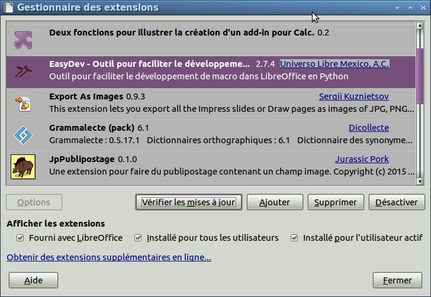

Introduction
============
EasyDev peut vous aider pour développer des macros dans LibreOffice ou OpenOffice.
En particulier, il permet d'utiliser des timers, du multitâche, même en Basic.

Installation
------------
    * Télécharger la dernière version sur `GitHub`_.
    * Ouvrir LibreOffice ou OpenOffice
    * Outils -> Gestionnaire des extensions...
    * Ajouter...

Test de l'installation
----------------------

.. code-block:: vbnet

    Sub Test()
        'Création du service EasyDev
        util = createUnoService("org.universolibre.EasyDev")

        MsgBox util.VERSION
    End Sub

.. _GitHub: https://github.com/UniversoLibreMexicoAC/easydev/tree/master/files
