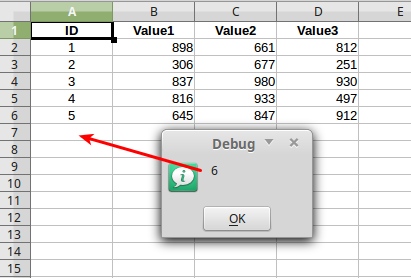

Calc
====

Obtenir feuille
---------------

Obtenir tous les noms de feuilles.

.. code-block:: vbnet

    util = createUnoService("org.universolibre.EasyDev")

    'Get current doc
    doc = util.getDoc("")
    names = util.getSheetsNames(doc)
    util.msgbox(names)

Obtenir la feuille active.

.. IMPORTANT::
   Current doc can be IDE, and IDE not have sheets

.. code-block:: vbnet

    util = createUnoService("org.universolibre.EasyDev")
    address = createUnoStruct("org.universolibre.EasyDev.CellRangeAddress")

    'Get active sheet from active doc
    sheet = util.getSheet(address)
    msgbox sheet.Name

C'est mieux en utilisant un doc "explicite"

.. code-block:: vbnet

    doc = ThisComponent
    address.Doc = doc
    sheet = util.getSheet(address)
    MsgBox sheet.Name

Obtenir la feuille active d'un autre document

.. code-block:: vbnet

    address.Doc = util.getDoc("Untitled 3.ods")
    sheet = util.getSheet(address)
    MsgBox sheet.Name

Obtenir la feuille par son nom.

.. code-block:: vbnet

    address.Doc = ThisComponent
    address.Sheet = "Sheet2"
    sheet = util.getSheet(address)
    MsgBox sheet.Name

Obtenir la feuille par l'index. L'index commence à 0.

.. code-block:: vbnet

    address.Doc = ThisComponent
    address.Sheet = 1
    sheet = util.getSheet(address)
    MsgBox sheet.Name

Obtenir la dernière feuille par l'index.

.. code-block:: vbnet

    address.Doc = ThisComponent
    address.Sheet = -1
    sheet = util.getSheet(address)
    MsgBox sheet.Name

Définir la feuille active
-------------------------

Feuille active par nom.

.. code-block:: vbnet

    util = createUnoService("org.universolibre.EasyDev")
    address = createUnoStruct("org.universolibre.EasyDev.CellRangeAddress")

    doc = ThisComponent
    address.Doc = doc
    address.Sheet = "Sheet2"

    util.sheetActivate(address)

Feuille active par index. Dernier index == -1

.. code-block:: vbnet

    doc = ThisComponent
    address.Doc = doc
    address.Sheet = -1

    util.sheetActivate(address)

Insertion de feuilles
---------------------

Insertion d'une feuille en position. Donne une erreur si la feuille existe

.. code-block:: vbnet

    util = createUnoService("org.universolibre.EasyDev")
    address = createUnoStruct("org.universolibre.EasyDev.CellRangeAddress")

    address.Doc = ThisComponent
    address.Sheet = "New Sheet"
    util.sheetInsert(address, 0, False)

Renommer la feuille si elle existe. Obtenir "New Sheet_1", "New Sheet_2", etc...

.. code-block:: vbnet

    address.Doc = ThisComponent
    address.Sheet = "New Sheet"
    util.sheetInsert(address, 0, True)

Insertion en dernière position.

.. code-block:: vbnet

    address.Doc = ThisComponent
    address.Sheet = "New Sheet"
    util.sheetInsert(address, -1, True)

Insertion de plus qu'une feuille.

.. code-block:: vbnet

    address.Doc = ThisComponent
    address.Sheet = Array("One", "Two", "Other")
    util.sheetInsert(address, 0, True)

Insertion d'une feuille à partir d'un document
----------------------------------------------

Seulement pour LibreOffice, pour OpenOffice utiliser : :ref:`copysheet`.
Insérer toutes les feuilles d'un document source dans un document cible

.. code-block:: vbnet

    util = createUnoService("org.universolibre.EasyDev")
    source = createUnoStruct("org.universolibre.EasyDev.CellRangeAddress")
    target = createUnoStruct("org.universolibre.EasyDev.CellRangeAddress")

    doc = ThisComponent
    source.Doc = doc

    new_doc = util.newDoc("")
    target.Doc = new_doc

    util.sheetInsertFromDoc(source, target, -1, False)

Supprimer feuille
-----------------

.. IMPORTANT::
   L'index des feuilles change si on supprime quelques feuilles.

Supprimer feuille par nom

.. code-block:: vbnet

    util = createUnoService("org.universolibre.EasyDev")
    address = createUnoStruct("org.universolibre.EasyDev.CellRangeAddress")

    address.Doc = ThisComponent
    address.Sheet = "Sheet2"
    util.sheetRemove(address, False)

Supprimer feuille par index

.. code-block:: vbnet

    address.Doc = ThisComponent
    address.Sheet = 1
    util.sheetRemove(address, False)

Supprimer feuille par index, dernière feuille

.. code-block:: vbnet

    address.Doc = ThisComponent
    address.Sheet = -1
    util.sheetRemove(address, False)

D'abord obtenir la feuille et la supprimer par objet

.. code-block:: vbnet

    address.Doc = ThisComponent
    address.Sheet = "Sheet6"
    sheet = util.getSheet(address)
    address.Sheet = sheet
    util.sheetRemove(address, False)

Supprimer plus d'une feuille, par index, nom ou objet

.. code-block:: vbnet

    address.Doc = ThisComponent
    address.Sheet = Array(0, "Sheet4", "Sheet2", sheet, -1)
    util.sheetRemove(address, False)

Supprimer toutes les feuilles, exceptée une 

.. code-block:: vbnet

    address.Doc = ThisComponent
    address.Sheet = "Sheet3"
    util.sheetRemove(address, True)

Supprimer toutes les feuilles, exceptées plus d'une

.. code-block:: vbnet

    address.Doc = ThisComponent
    address.Sheet = Array("Sheet2", "Sheet6")
    util.sheetRemove(address, True)

Déplacer Feuille
----------------

Déplacer feuille par nom vers position.

.. code-block:: vbnet

    util = createUnoService("org.universolibre.EasyDev")
    address = createUnoStruct("org.universolibre.EasyDev.CellRangeAddress")

    address.Doc = ThisComponent
    address.Sheet = "Sheet2"
    util.sheetMove(address, 0)

Déplacer première feuille vers dernière position

.. code-block:: vbnet

    address.Doc = ThisComponent
    address.Sheet = 0
    util.sheetMove(address, -1)

Déplacer feuille par objet

.. code-block:: vbnet

    address.Doc = ThisComponent
    address.Sheet = 1
    sheet = util.getSheet(address)
    address.Sheet = sheet
    util.sheetMove(address, -1)

Déplacer plus d'une feuille

.. code-block:: vbnet

    address.Doc = ThisComponent
    address.Sheet = Array ("Sheet2", "Sheet4")
    util.sheetMove(address, -1)

Trier feuilles
--------------

Trier feuilles par nom

.. code-block:: vbnet

    util.sheetSort(ThisComponent, True)

Trier en ordre inverse

.. code-block:: vbnet

    util.sheetSort(ThisComponent, False)

Copier feuille
--------------

Copier feuille par nom en dernière position.

.. code-block:: vbnet

    util = createUnoService("org.universolibre.EasyDev")
    address = createUnoStruct("org.universolibre.EasyDev.CellRangeAddress")

    address.Doc = ThisComponent
    address.Sheet = "Sheet2"
    util.sheetCopy(address, "NewName", -1, False)

Copier feuille par index vers position.

.. code-block:: vbnet

    address.Doc = ThisComponent
    address.Sheet = 0
    util.sheetCopy(address, "OtherName", -1, False)

Copier feuille par index vers position et la renommer si elle existe

.. code-block:: vbnet

    address.Doc = ThisComponent
    address.Sheet = 0
    util.sheetCopy(address, "NameX", -1, True)

Copier plus d'une feuille

.. code-block:: vbnet

    address.Doc = ThisComponent
    address.Sheet = Array("Sheet1", "Sheet2")
    util.sheetCopy(address, "NameY", -1, True)

Copier toutes les feuilles

.. code-block:: vbnet

    address.Doc = ThisComponent
    address.Sheet = ""
    util.sheetCopy(address, "NameNext", -1, False)

.. _copysheet:

Copier feuille vers document
----------------------------

.. IMPORTANT::
   Le document d'origine doit être sauvegardé avant copie de feuille

::

    sheetCopyToDoc(SOURCE, TARGET, POSITION, RENAME, BY_VALUE)

Source et cible sont des struct ``org.universolibre.EasyDev.CellRangeAddress``

* **SOURCE**: Document and sheet origin
* **TARGET**: Target document
* **POSITION**: Target position for example first position (0) or last position (-1)
* **RENAME**: If exists sheet name in target, rename sheet origin
* **BY_VALUE**: False, copy by formula, True, copy by values.

Copier toutes les feuilles d'un document source vers un document cible

.. code-block:: vbnet

    util = createUnoService("org.universolibre.EasyDev")
    source = createUnoStruct("org.universolibre.EasyDev.CellRangeAddress")
    target = createUnoStruct("org.universolibre.EasyDev.CellRangeAddress")

    doc = ThisComponent
    source.Doc = doc

    new_doc = util.newDoc("")
    target.Doc = new_doc

    util.sheetCopyToDoc(source, target, -1, True, False)

Copier feuille par nom.

.. code-block:: vbnet

    doc = ThisComponent
    source.Doc = doc
    source.Sheet = "Source"
    new_doc = util.newDoc("")
    target.Doc = new_doc

    util.sheetCopyToDoc(source, target, -1, True, False)

Copier feuille par index.

.. code-block:: vbnet

    doc = ThisComponent
    source.Doc = doc
    source.Sheet = 1
    new_doc = util.newDoc("")
    target.Doc = new_doc

    util.sheetCopyToDoc(source, target, -1, True, False)

Copier plus d'une feuille

.. code-block:: vbnet

    doc = ThisComponent
    source.Doc = doc
    source.Sheet = Array(0, "Source")
    new_doc = util.newDoc("")
    target.Doc = new_doc

    util.sheetCopyToDoc(source, target, -1, True, False)

Copier feuille par valeur

.. code-block:: vbnet

    doc = ThisComponent
    source.Doc = doc
    source.Sheet = "Source"
    new_doc = util.newDoc("")
    target.Doc = new_doc

    util.sheetCopyToDoc(source, target, -1, True, True)

Renommer feuille
----------------

Renommer feuille par nom.

.. code-block:: vbnet

    util = createUnoService("org.universolibre.EasyDev")
    address = createUnoStruct("org.universolibre.EasyDev.CellRangeAddress")

    address.Doc = ThisComponent
    address.Sheet = "Sheet2"
    util.sheetName(address, "Two")

Renommer feuille par index.

.. code-block:: vbnet

    address.Doc = ThisComponent
    address.Sheet = 0
    util.sheetName(address, "First")

Renommer plus d'une feuille.

.. code-block:: vbnet

    address.Doc = ThisComponent
    address.Sheet = Array(0, "Sheet3")
    util.sheetName(address, "NewName")

Montrer ou cacher une feuille
-----------------------------

.. IMPORTANT::
   Si vous essayez de cacher toutes les feuilles, pas d'erreur mais toujours une feuille sera visible

Cacher feuille par nom.

.. code-block:: vbnet

    util = createUnoService("org.universolibre.EasyDev")
    address = createUnoStruct("org.universolibre.EasyDev.CellRangeAddress")

    address.Doc = ThisComponent
    address.Sheet = "Sheet2"
    util.sheetVisible(address, False)

Cacher la première feuille.

.. code-block:: vbnet

    address.Doc = ThisComponent
    address.Sheet = 0
    util.sheetVisible(address, False)

Cacher la dernière feuille.

.. code-block:: vbnet

    address.Doc = ThisComponent
    address.Sheet = -1
    util.sheetVisible(address, False)

Cacher toutes les feuilles, excepté une

.. code-block:: vbnet

    sheets = util.getSheetsNames(ThisComponent)
    'First show sheet
    address.Doc = ThisComponent
    address.Sheet = sheets(0)
    util.sheetVisible(address, True)
    'Remove sheet from array
    sheets = util.delete(sheets, 0)
    'And hide the rest of sheets
    address.Sheet = sheets
    util.sheetVisible(address, False)

Montrer toutes les feuilles

.. code-block:: vbnet

    sheets = util.getSheetsNames(ThisComponent)
    address.Doc = ThisComponent
    address.Sheet = sheets
    util.sheetVisible(address, True)

Mot de passe feuille
--------------------

Définir un mot de passe par nom.

.. code-block:: vbnet

    util = createUnoService("org.universolibre.EasyDev")
    address = createUnoStruct("org.universolibre.EasyDev.CellRangeAddress")

    address.Doc = ThisComponent
    address.Sheet = "Sheet2"
    util.sheetPassword(address, "letmein", False)

Définir un mot de passe par index.

.. code-block:: vbnet

    address.Doc = ThisComponent
    address.Sheet = -1
    util.sheetPassword(address, "letmein", False)

Set password all sheet.

.. code-block:: vbnet

    address.Doc = ThisComponent
    address.Sheet = ""
    util.sheetPassword(address, "letmein", False)

Supprimer le mot de passe de toutes les feuilles.

.. code-block:: vbnet

    address.Doc = ThisComponent
    address.Sheet = ""
    util.sheetPassword(address, "letmein", True)

Cellules
--------
Obtenir la cellule active, retourne toujours une cellule

.. code-block:: vbnet

    Sub getCellDoc()
        util = createUnoService("org.universolibre.EasyDev")
        address = createUnoStruct("org.universolibre.EasyDev.CellRangeAddress")

        address.Current = True
        cell = util.getCell(address)
        msg = util.format("{} {}", Array(cell.ImplementationName, cell.AbsoluteName))
        util.msgbox(msg)
    End Sub

Obtenir la cellule active d'un document par son titre, le document doit être ouvert

.. code-block:: vbnet

        address.Doc = "test.ods"    'Title doc
        address.Current = True
        cell = util.getCell(address)
        msg = util.format("{} {}", Array(cell.ImplementationName, cell.AbsoluteName))
        util.msgbox(msg)

Obtenir la cellule active d'un objet doc

.. code-block:: vbnet

        doc = util.getDoc("")
        address.Doc = doc
        address.Current = True
        cell = util.getCell(address)
        msg = util.format("{} {}", Array(cell.ImplementationName, cell.AbsoluteName))
        util.msgbox(msg)

Obtenir une cellule d'un objet doc, feuille par nom, cellule par nom

.. code-block:: vbnet

    doc = util.getDoc("")
    address.Doc = doc
    address.Sheet = "Sheet2"
    address.Name = "B5"
    cell = util.getCell(address)
    msg = util.format("{} {}", Array(cell.ImplementationName, cell.AbsoluteName))
    util.msgbox(msg)

Obtenir une cellule d'un objet doc, feuille par nom, cellule par colonne, ligne

.. code-block:: vbnet

    doc = util.getDoc("")
    address.Doc = doc
    address.Sheet = "Sheet2"
    address.Name = ""
    address.Col = 1
    address.Row = 4
    cell = util.getCell(address)
    msg = util.format("{} {}", Array(cell.ImplementationName, cell.AbsoluteName))
    util.msgbox(msg)

Obtenir une cellule d'un objet feuille, l'objet doc est omis

.. code-block:: vbnet

    sheet = doc.getCurrentController().getActiveSheet()
    address.Sheet = sheet
    address.Name = "D5"
    cell = util.getCell(address)
    msg = util.format("{} {}", Array(cell.ImplementationName, cell.AbsoluteName))
    util.msgbox(msg)

.. _getranges:

Plages
------

Obtenir la plage courante

.. code-block:: vbnet

    Sub getRangeDoc()
        util = createUnoService("org.universolibre.EasyDev")
        address = createUnoStruct("org.universolibre.EasyDev.CellRangeAddress")

        address.Current = True
        range = util.getRange(address)
        msg = util.format("{} {}", Array(range.ImplementationName, range.AbsoluteName))
        util.msgbox(msg)
    End Sub

Obtenir la plage active à partir d'un document par le titre , le document doit être ouvert

.. code-block:: vbnet

    address.Doc = "test.ods"    'Title doc
    address.Current = True
    range = util.getRange(address)
    msg = util.format("{} {}", Array(range.ImplementationName, range.AbsoluteName))
    util.msgbox(msg)

Obtenir la plage active d'un objet doc

.. code-block:: vbnet

        doc = util.getDoc("")
        address.Doc = doc
        address.Current = True
        range = util.getRange(address)
        msg = util.format("{} {}", Array(range.ImplementationName, range.AbsoluteName))
        util.msgbox(msg)

Obtenir une plage d'un objet doc, feuille par nom, plage par position

.. code-block:: vbnet

    address.Sheet = "Sheet2"
    address.Name = ""
    address.Col = 1
    address.Row = 4
    address.EndCol = 3
    address.EndRow = 9
    range = util.getRange(address)
    msg = util.format("{} {}", Array(range.ImplementationName, range.AbsoluteName))
    util.msgbox(msg)

Obtenir une plage d'un objet feuille , l'objet doc est omis.

.. code-block:: vbnet

    sheet = doc.getCurrentController().getActiveSheet()
    address.Sheet = sheet
    address.Name = "D5:E10"
    range = util.getRange(address)
    msg = util.format("{} {}", Array(range.ImplementationName, range.AbsoluteName))
    util.msgbox(msg)

Ajouter des plages dans un conteneur.

.. code-block:: vbnet

    util = createUnoService("org.universolibre.EasyDev")
    address = createUnoStruct("org.universolibre.EasyDev.CellRangeAddress")

    address.Doc = ThisComponent
    address.Sheet = "Sheet1"
    address.Name = "A1:B2"
    range = util.getRange(address)
    'Create container, first argument is a document
    container = util.addRanges(ThisComponent, range)
    MsgBox container.getRangeAddressesAsString()

    'Add range to container
    address.Name = "A4:B5"
    range = util.getRange(address)
    'First argument is a container, previously created
    container = util.addRanges(container, range)
    MsgBox container.getRangeAddressesAsString()

Conteneur initial à partir de plus d'une plage

.. code-block:: vbnet

    address.Doc = ThisComponent
    address.Sheet = "Sheet1"
    address.Name = "B1:C2"
    r1 = util.getRange(address)
    address.Name = "B4:C4"
    r2 = util.getRange(address)
    address.Name = "D6:E6"
    r3 = util.getRange(address)
    ranges = Array(r1, r2, r3)

    'Create container, first argument is a document
    container = util.addRanges(ThisComponent, ranges)
    MsgBox container.getRangeAddressesAsString()

Supprimer les plages à partir d'un conteneur.

.. code-block:: vbnet

    r = util.removeRanges(container, r2)
    MsgBox container.getRangeAddressesAsString()

Obtenir toutes les colonnes d'une plage, obtenir un conteneur.

.. code-block:: vbnet

    doc = ThisComponent

    address.Doc = doc
    address.Sheet = "Sheet1"
    address.Name = "B1:E1"
    range = util.getRange(address)

    columns = util.getColumns(ThisComponent, range)

    util.selectRange(doc, columns)

Obtenir toutes les lignes d'une plage, obtenir un conteneur.

.. code-block:: vbnet

    doc = ThisComponent

    address.Doc = doc
    address.Sheet = "Sheet1"
    address.Name = "A5:A10"
    range = util.getRange(address)

    rows = util.getRows(ThisComponent, range)

    util.selectRange(doc, rows)

Sélectionner Plage
------------------

.. code-block:: vbnet

    Sub SelectRange()
        util = createUnoService("org.universolibre.EasyDev")
        address = createUnoStruct("org.universolibre.EasyDev.CellRangeAddress")

        doc = util.getDoc("")
        address.Doc = doc
        address.Sheet = "Sheet2"
        address.Name = "B5:C10"
        range = util.getRange(address)

        'Select
        util.selectRange(doc, range)

    End Sub

Région courante
---------------

.. code-block:: vbnet

    Sub getCurrentRegion()

        util = createUnoService("org.universolibre.EasyDev")
        address = createUnoStruct("org.universolibre.EasyDev.CellRangeAddress")

        address.Current = True
        cell = util.getCell(address)
        msg = util.format("{} {}", Array(cell.ImplementationName, cell.AbsoluteName))
        util.msgbox(msg)

    End Sub

Seulement une cellule dans la région courante est nécessaire, obtenir le curseur

.. code-block:: vbnet

    cursor = util.getCurrentRegion(cell, True)
    msg = util.format("{} {}", Array(cursor.ImplementationName, cursor.AbsoluteName))
    util.msgbox(msg)

Seulement une cellule dans la région courante est nécessaire, obtenir la plage

.. code-block:: vbnet

    range = util.getCurrentRegion(cell, False)
    msg = util.format("{} {}", Array(range.ImplementationName, range.AbsoluteName))
    util.msgbox(msg)

Obtenir les cellules vides
--------------------------

.. code-block:: vbnet

    util = createUnoService("org.universolibre.EasyDev")
    address = createUnoStruct("org.universolibre.EasyDev.CellRangeAddress")

    'Get active cell, always get one cell
    address.Current = True
    cell = util.getCell(address)

    ranges = util.getEmpty(cell)
    util.selectRange(ThisComponent, ranges)

Obtenir les cellules visibles
-----------------------------

.. code-block:: vbnet

    util = createUnoService("org.universolibre.EasyDev")
    address = createUnoStruct("org.universolibre.EasyDev.CellRangeAddress")

    'Get active cell, always get one cell
    address.Current = True
    cell = util.getCell(address)

    ranges = util.getVisible(cell)
    util.selectRange(ThisComponent, ranges)

Dernière ligne
--------------

Obtenir la dernière ligne dans la région courante.

.. code-block:: vbnet

    Sub getLastRow()
        util = createUnoService("org.universolibre.EasyDev")
        address = createUnoStruct("org.universolibre.EasyDev.CellRangeAddress")

        address.Current = True
        cell = util.getCell(address)
        row = util.getLastRow(cell)
        util.msgbox(row)
    End Sub

Valeur suivante
---------------

Dans une plage, obtenir la valeur suivante en colonne relative (0), ou (1), etc.

.. code-block:: vbnet

    Sub getNextID()
        util = createUnoService("org.universolibre.EasyDev")
        address = createUnoStruct("org.universolibre.EasyDev.CellRangeAddress")

        address.Current = True
        cell = util.getCell(address)
        value = util.getNextID(cell, 0)
        util.msgbox(value)
    End Sub

Valeur de cellule
-----------------

Automatiquement détecter le type de données : Chaîne, valeur ou formule.

.. code-block:: vbnet

    Sub CellValue()
        util = createUnoService("org.universolibre.EasyDev")
        address = createUnoStruct("org.universolibre.EasyDev.CellRangeAddress")

        address.Current = True
        cell = util.getCell(address)

        value = "String"
        util.setValue(cell, value)
        value = util.getValue(cell)
        util.msgbox(value)

        value = 12345
        util.setValue(cell, value)
        value = util.getValue(cell)
        util.msgbox(value)

        value = "=SUM(A1:C1)"
        util.setValue(cell, value)
        value = util.getValue(cell)
        util.msgbox(value)

    End Sub

.. _setdata:

Définir des données
-------------------

Automatiquement calculer la dimension des données.

.. code-block:: vbnet

    Sub SetData()
        util = createUnoService("org.universolibre.EasyDev")
        address = createUnoStruct("org.universolibre.EasyDev.CellRangeAddress")

        'Get active cell, always get one cell
        address.Current = True
        cell = util.getCell(address)

        data = Array( _
            Array(1, "Uno", "Tres"), _
            Array(2, "Dos", "Cuatro"), _
            Array(3, "Tres", "Cinco"), _
        )
        'Automatically calculate width and height of data size
        util.setData(cell, data)

    End Sub

Obtenir des données
-------------------

Obtenir un tableau de données à partir d'une cellule, automatiquement obtenir la région courante.

.. code-block:: vbnet

    util = createUnoService("org.universolibre.EasyDev")
    address = createUnoStruct("org.universolibre.EasyDev.CellRangeAddress")

    'Get active cell, always get one cell
    address.Current = True
    cell = util.getCell(address)

    data = util.getData(cell, False)
    util.msgbox(data)

Get data array, only visible cells.

.. code-block:: vbnet

    data = util.getData(cell, True)
    util.msgbox(data)

