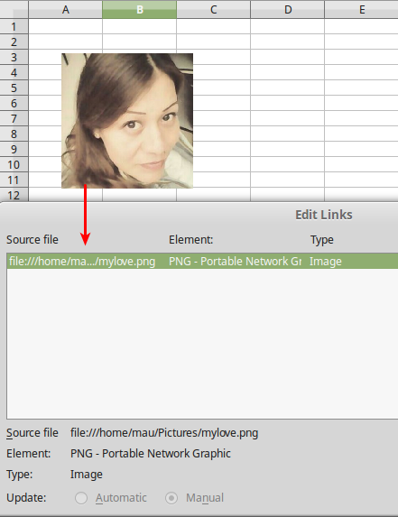
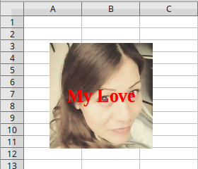

Images et Formes
============== =

Insertion d'image
-----------------

Insertion d'image à partir d'un chemin, lien image

.. code-block:: vbnet

    util = createUnoService("org.universolibre.EasyDev")
    data = createUnoStruct("org.universolibre.EasyDev.ImageData")
    rec = createUnoStruct("com.sun.star.awt.Rectangle")

    rec.X = 1000
    rec.Y = 1000
    rec.Width = 4000
    rec.Height = 4000
    doc = ThisComponent
    data.Doc = doc
    data.Sheet = 0
    data.Path = "/home/mau/Pictures/mylove.png"
    data.Name = "With Link"
    data.Link = True
    data.PosSize = rec
    image = util.imageAdd(data)

Resultat.

Insertion d'image à partir d'un chemin, image embarquée

.. code-block:: vbnet

    util = createUnoService("org.universolibre.EasyDev")
    data = createUnoStruct("org.universolibre.EasyDev.ImageData")
    rec = createUnoStruct("com.sun.star.awt.Rectangle")

    rec.X = 1000
    rec.Y = 1000
    rec.Width = 4000
    rec.Height = 4000
    doc = ThisComponent
    data.Doc = doc
    data.Sheet = 0
    data.Path = "/home/mau/Pictures/mylove.png"
    data.Name = "unLink"

    'Embebbed image
    data.Link = False
    data.PosSize = rec
    image = util.imageAdd(data)

Insertion d'image et ajout de texte.

.. code-block:: vbnet

    util = createUnoService("org.universolibre.EasyDev")
    data = createUnoStruct("org.universolibre.EasyDev.ImageData")
    rec = createUnoStruct("com.sun.star.awt.Rectangle")

    properties = Array( _
        Array("String", "My Love"), _
        Array("CharColor", RGB(255,0,0)), _
        Array("CharHeight", 20), _
        Array("CharWeight", 150), _
    )

    rec.X = 1000
    rec.Y = 1000
    rec.Width = 4000
    rec.Height = 4000
    doc = ThisComponent
    data.Doc = doc
    data.Sheet = 0
    data.Path = "/home/mau/Pictures/mylove.png"
    data.Name = "MyLove"
    data.Link = False
    data.PosSize = rec
    data.Properties = properties
    image = util.imageAdd(data)

Insertion de forme
------------------

Insertion  d'un rectangle

.. code-block:: vbnet

    rec.X = 1000
    rec.Y = 1000
    rec.Width = 4000
    rec.Height = 4000
    doc = ThisComponent
    data.Doc = doc
    data.Sheet = 0
    data.Name = "MyRec"
    data.Type = "Rectangle"
    data.PosSize = rec
    shape = util.imageAdd(data)

Insertion d'ellipse

.. code-block:: vbnet

    properties = Array( _
        Array("String", "Python!!"), _
        Array("CharColor", RGB(255,255,0)), _
        Array("CharHeight", 20), _
        Array("CharWeight", 150), _
    )
    rec.X = 1000
    rec.Y = 1000
    rec.Width = 4000
    rec.Height = 4000
    doc = ThisComponent
    data.Doc = doc
    data.Sheet = 0
    data.Name = "MyEllipse"
    data.Type = "Ellipse"
    data.PosSize = rec
    data.Properties = properties
    shape = util.imageAdd(data)

Insertion de ligne

.. code-block:: vbnet

    properties = Array( _
        Array("LineColor", RGB(255,100,0)), _
        Array("LineWidth", 200), _
    )
    rec.X = 1000
    rec.Y = 1000
    rec.Width = 4000
    rec.Height = 4000
    doc = ThisComponent
    data.Doc = doc
    data.Sheet = 0
    data.Name = "MyLine"
    data.Type = "Line"
    data.PosSize = rec
    data.Properties = properties
    shape = util.imageAdd(data)

Insertion de texte.

.. code-block:: vbnet

    properties = Array( _
        Array("String", "Power Python!"), _
        Array("CharHeight", 20), _
        Array("CharWeight", 150, _
    )
    rec.X = 1000
    rec.Y = 1000
    rec.Width = 5000
    rec.Height = 1000
    doc = ThisComponent
    data.Doc = doc
    data.Sheet = 0
    data.Name = "MyText"
    data.Type = "Text"
    data.PosSize = rec
    data.Properties = properties
    shape = util.imageAdd(data)
